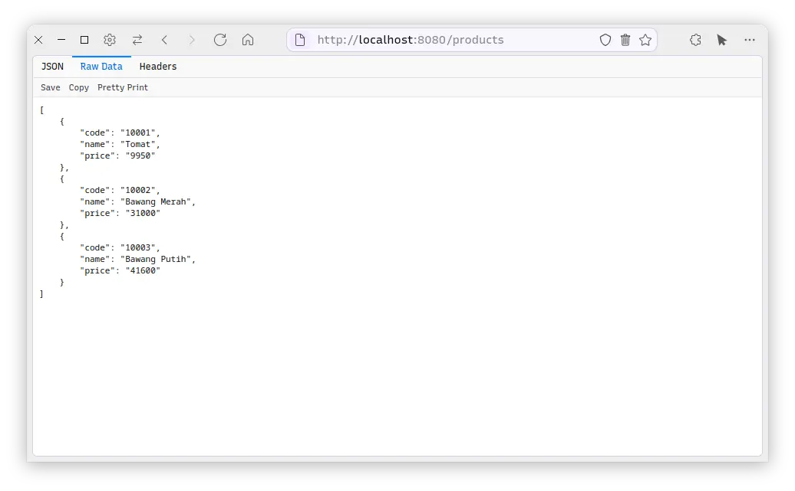
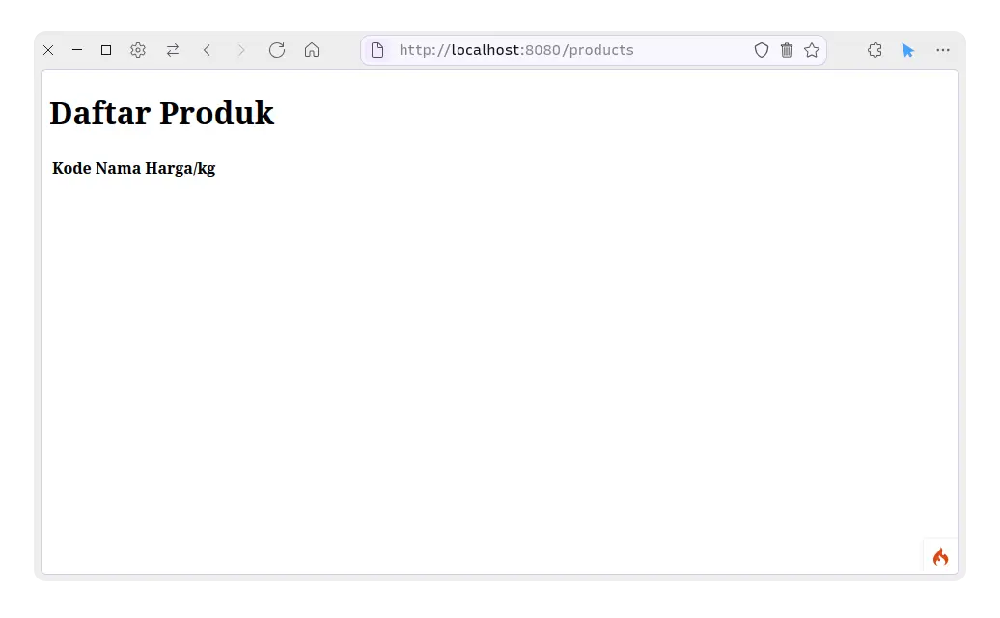
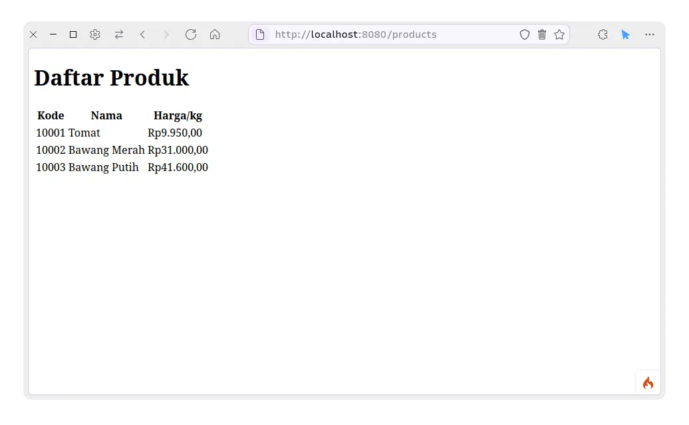

Contoh membuat website produk sederhana menggunakan CodeIgniter 4.


# Autoload

Tidak ada yang perlu diubah.


# Config

## Database

Mengatur config sensitif (seperti database) di file logic itu berbahaya.
Orang lain dapat mengambil kredensial sensitif tersebut dan menyalahgunakannya.

Disarankan menggunakan file `.env`.
Salin file `env` ke `.env` dan masukkan konfigurasi yang diperlukan.

```env
# .env

# ...
database.default.hostname = localhost
database.default.database = learn
database.default.username = learn
database.default.password = learn
database.default.DBDriver = MySQLi
# ...
```

> Masukkan juga `.env` ke dalam file `.gitignore` atau semacamnya agar file `.env` tidak ikut diunggah jika menggunakan aplikasi manajemen source code seperti `git`.

### Membuat Database Otomatis

Untuk membuat database secara otomatis, jalankan perintah di bawah ini ke dalam command line/terminal.

```sh
php spark db:create
```

Nama database yang akan dibuat akan mengikuti nama database yang telah diatur di dalam file `.env`.

Cara tersebut sangat mudah karena tidak perlu menggunakan SQL atau aplikasi editor database seperti phpMyAdmin.


# Migration

Migration digunakan untuk membuat table ke dalam database dengan mudah.
Tidak diperlukan untuk membuat file SQL atau membuat table sendiri melalui aplikasi editor database.

## Membuat Migration

Untuk membuat migration, jalankan perintah di bawah ini ke command line/terminal.
Ubah `<name>` dengan nama yang diinginkan, contohnya `Product`.

```sh
php spark make:migration <name>
```

File migration akan otomatis dibuatkan dan bisa ditemukan di folder `app/Database/Migrations`, sesuai petunjuk yang muncul setelah perintah berhasil dijalankan.

## Mengisi Migration

Pada umumnya, satu file migration hanya digunakan untuk membuat satu table.
Jika ingin membuat table lainnya atau mengubah isi table yang sudah di-*migrate*, silakan [buat file migration baru](#membuat-migration).

Buka file migration yang tadi telah dibuat.
Di dalamnya terdapat kode seperti ini.

```php
// app/Database/Migrations/2024-10-11-140000_Product.php

public function up()
{
  //
}

// ...

public function down()
{
  //
}
```

Di dalam blok kode dari function `up()` adalah tempat untuk menaruh kode yang digunakan untuk membuat table.
CodeIgniter 4 memiliki cara mudah untuk dapat membuat table di dalam migration dengan menggunakan `$this->forge`.

Sebagai contoh, berikut ini adalah cara membuat table.

```php
// app/Database/Migrations/2024-10-11-140000_Product.php

public function up()
{
  $this->forge->addField([
    'code' => [
      'type' => 'INT',
      'constraint' => 5
    ],
    'name' => [
      'type' => 'VARCHAR',
      'constraint' => 50
    ],
    'price' => [
      'type' => 'VARCHAR',
      'constraint' => 50
    ]
  ]);
  $this->forge->addPrimaryKey('code');
  $this->forge->createTable('products');
}
```

Selain function `up()`, terdapat juga function `down()`.
Di dalam `down()` adalah tempat untuk menaruh kode yang dijalankan ketika rollback migration dilakukan.

Biasanya, apa yang dilakukan di dalam `up()` berlawanan dengan apa yang akan dilakukan di dalam `down()`.

Pada kode di atas, pada intinya table `products` dibuat di dalam function `up()`.
Yang harus dilakukan di dalam function `down()` adalah kebalikannya, yang berarti menghapus table `products`.

```php
// app/Database/Migrations/2024-10-11-140000_Product.php

public function down()
{
  $this->forge->dropTable('products');
}
```

Dengan begitu, kode migration tersebut telah jadi.

Untuk melihat apa saja yang bisa dilakukan untuk membuat table, dapat dibaca di dokumentasi berikut.
https://codeigniter.com/user_guide/dbmgmt/forge.html#creating-tables

## Menjalankan Migration

Migration dapat dijalankan menggunakan perintah berikut.

```sh
php spark migrate
```

Jika tidak ada kendala, database dapat langsung terisi dengan table-table yang dibuat di dalam file migration.


# Model

Dalam pola pembuatan aplikasi dengan konsep MVC, model berfungsi untuk mengatur satu tipe data aplikasi.
Contohnya dalam kasus ini adalah Product.
Model mengatur cara untuk mengambil dan menyimpan data dari/ke database.

## Membuat Model

Untuk membuat model, jalankan perintah di bawah ini ke command line/terminal.
Ubah `<name>` dengan nama model yang diinginkan, contohnya `Product`.

```sh
php spark make:model <name>
```

File model akan otomatis dibuatkan dan bisa ditemukan di folder `app/Models`, sesuai petunjuk yang muncul.

## Mengatur Model

Terdapat banyak pengaturan yang bisa diubah di dalam file model. Untuk sekarang, pengaturan di model bisa disesuaikan dengan kode yang dibuat di file migration terkait.

```php
// app/Models/Product.php

// ...
protected $table            = 'products';
protected $primaryKey       = 'code';
protected $allowedFields    = [
  'code',
  'name',
  'price',
];
// ...
```

Setelah diatur, model siap digunakan.


# Seeder

Seeder adalah file yang digunakan untuk dapat mempopulasikan data ke database.

## Membuat Seeder

Untuk membuat seeder, jalankan perintah di bawah ini ke command line/terminal.
Ubah `<name>` dengan nama yang diinginkan, contohnya `ProductSeeder`.

```sh
php spark make:seeder <name>
```

File seeder akan otomatis dibuatkan dan bisa ditemukan di folder `app/Database/Seeds`, sesuai petunjuk yang muncul.

## Mengisi Seeder

Buka file seeder yang tadi telah dibuat.
Di dalamnya terdapat kode seperti ini.

```php
public function run()
{
  //
}
```

Di dalam function `run()` adalah tempat untuk mengisi kode untuk insert data ke dalam table di database.

Terdapat 2 cara untuk mengakses data dari database, yaitu dengan Query Builder atau Model.
Karena sudah membuat model, proses pengolahan data akan memanfaatkan model.

```php
// app/Database/Seeds/ProductSeeder.php

public function run()
{
  // Untuk memanggil model Product
  $product = new App\Models\Product();
  $data = [
    [
      'code' => 10001,
      'name' => 'Tomat',
      'price' => '9950'
    ],
    [
      'code' => 10002,
      'name' => 'Bawang Merah',
      'price' => '31000'
    ],
    [
      'code' => 10003,
      'name' => 'Bawang Putih',
      'price' => '41600'
    ],
  ];
  $product->insertBatch($data);
}
```

Cara penggunaan model untuk mengolah data dapat dilihat di dokumentasi berikut.
https://codeigniter.com/user_guide/models/model.html#working-with-data

## Menjalankan Seeder

Seeder dapat dijalankan menggunakan perintah berikut.

```sh
php spark db:seed <seeder_name>
```

Jika tidak ada kendala, database dapat langsung terisi dengan table-table yang dibuat di dalam file migration.


# Controller

Dalam pola pembuatan aplikasi dengan konsep MVC, controller adalah tempat di mana semua logika aplikasi dijalankan.
Controller berisi *business logic* dari sebuah aplikasi.

## Membuat Controller

Untuk membuat controller, jalankan perintah di bawah ini ke command line/terminal.
Ubah `<name>` dengan nama controller yang diinginkan, contohnya `Product`.

```sh
php spark make:controller <name>
```

File controller akan otomatis dibuatkan dan bisa ditemukan di folder `app/Controllers`, sesuai petunjuk yang muncul.

## Mengisi Controller

Buka file controller yang tadi telah dibuat.
Di dalamnya terdapat kode seperti ini.

```php
// app/Controllers/Product.php

class Product extends BaseController
{
  public function index()
  {
    //
  }
}
```

Function `index()` adalah function default yang dijalankan oleh CodeIgniter sebagai halaman utama suatu path URL.
Di dalamnya bisa diisi kode untuk logika aplikasi, manipulasi data, mengirim respon, menampilkan view, dsb.

Karena belum membuat view, untuk sekarang hanya akan mencoba untuk menampilkan semua data yang ada di Product.

```php
// app/Controllers/Product.php

public function index()
{
  $model = new App\Models\Product();

  // Mengembalikan data berupa respon HTTP dengan JSON sebagai isinya.
  return response()->setJSON($model->findAll());
}
```

Belum ada hal apa pun yang terjadi, karena function tersebut belum dapat diakses dari URL mana pun.
Untuk itu, route perlu diatur agar dapat diakses.


# Route

Route digunakan untuk mengatur dan mengarahkan URL ke controller.
File route berada di `app/Config/Routes.php`.

Untuk menghubungkan controller Product sebelumnya dengan URL `/products` dapat menggunakan kode berikut.

```php
// app/Config/Routes.php

$routes->get('products', [App\Controllers\Product::class, 'index']);
//           ^            ^ Controller tujuan             ^ Nama function tujuan
//           ^ Nama URL path tujuan
```


# Melihat Hasil Sementara dari Controller

Sebelum dapat melihat hasilnya, CodeIgniter perlu dijalankan terlebih dahulu.
Gunakan perintah berikut untuk menyalakan server HTTP local.

```sh
php spark serve
```

> Untuk mematikan server local tersebut, gunakan <kbd>Ctrl</kbd>+<kbd>C</kbd> di command line/terminal.

Secara default, CodeIgniter akan berjalan di URL `localhost:8080/`.

Untuk melihat hasil yang dapat diperoleh dari controller, buka URL `localhost:8080/products` di browser.
URL tersebut sesuai dengan yang telah diatur di route sebelumnya.
Hasil yang muncul akan tampil sebagai berikut.



Cukup menarik, tapi hasil yang muncul masih dalam bentuk JSON, bukan HTML.
Untuk menampilkan HTML, diperlukan sebuah view.


# View

Dalam pola pembuatan aplikasi dengan konsep MVC, view adalah tampilan aplikasi.
View juga dapat digunakan untuk menampilkan data yang diperoleh dari controller.

## Membuat View

Semua file view berada di dalam folder `app/Views`.
Untuk membuat file view, buat file dengan ekstensi `.php` di folder tersebut, seperti `product.pnp`.

Isi file tersebut dengan kode HTML yang diinginkan.

```html
// app/Views/product.php

<!DOCTYPE html>
<html>
<head>
  <title>Produk</title>
</head>
<body>
  <h1>Daftar Produk</h1>
  <table>
    <thead>
      <tr>
        <th>Kode</th>
        <th>Nama</th>
        <th>Harga/kg</th>
      </tr>
    </thead>
    <tbody>
      <!-- Data produk akan ditampilkan di sini -->
    </tbody>
  </table>
</body>
</html>
```

## Menampilkan View

Agar dapat muncul di browser, view tersebut harus dipanggil.
Caranya dengan memanggil view tersebut dari controller yang diinginkan.

Dalam kasus ini, view tersebut akan ditampilkan dari controller Product.
Buka file controller product dan ubah isinya menjadi seperti berikut.

```php
// app/Controllers/Product.php

class Product extends BaseController
{
  public function index()
  {
    $model = new App\Models\Product();

    return view('product');
  }
}
```

`view()` digunakan untuk menampilkan file view yang berada di dalam folder `app/Views`.

File view yang perlu dipanggil `view()` dimasukkan tanpa menggunakan ekstensi `.php`.
Pada kasus ini, file `app/Views/product.php` dipanggil dengan `view('product')`.
Contoh lainnya, file `app/Views/admin/form.php` dipanggil dengan `view('admin/form')`.

Perubahan tersebut dapat dilihat di `localhost:8080/products`, sesuai yang diatur di route.



# Memasukkan Data dari Controller ke View

Ada hal yang belum ada di view yang berhasil ditampilkan sebelumnya.
Data produk yang seharusnya ada belum muncul.

## Mengirim Data

Sebelum dapat menampilkan data tersebut, controller perlu mengirimkan data ke view.
Buka file controller sebelumnya dan ubah seperti berikut.

```php
// app/Controllers/Product.php

class Product extends BaseController
{
  public function index()
  {
    $model = new App\Models\Product();

    return view('product', [
      'products' => $model->findAll(),
    ]);
  }
}
```

Di dalam `view()` tersebut terdapat 2 argumen.
Argumen pertama berisi nama file view yang akan ditampilkan.
Argumen kedua berisi array yang berisi nama variable dan data yang ingin dikirimkan ke view.

Berikut adalah penjelasan singkatnya.

```php
[
  'products' => $model->findAll(),
// ^           ^ Data yang akan dirimkan
// ^ Nama variable yang akan dikirimkan ke view
]
```

Dengan begitu, file view yang dituju dapat mengakses `$products` yang berisikan `$model->findAll()`.

## Menampilkan Data

File view `product.php` perlu diubah untuk dapat menampilkan data yang diterima dari controller.

Seperti pada penjelasan sebelumnya, file view ini dapat mengakses `$products`.
Ubah file view tersebut menjadi seperti berikut.

```php
// app/Views/product.php

<!DOCTYPE html>
<html>
<head>
  <title>Produk</title>
</head>
<body>
  <h1>Daftar Produk</h1>
  <table>
    <thead>
      <tr>
        <th>Kode</th>
        <th>Nama</th>
        <th>Harga/kg</th>
      </tr>
    </thead>
    <tbody>
      <?php foreach ($products as $product): ?>
        <tr>
          <td><?php echo $product['code']; ?></td>
          <td><?php echo $product['name']; ?></td>
          <td><?php echo $product['price']; ?></td>
        </tr>
      <?php endforeach ?>
    </tbody>
  </table>
</body>
</html>
```

Dengan begitu, saat membuka `localhost:8080/products` di browser, data akan muncul sesuai harapan.

